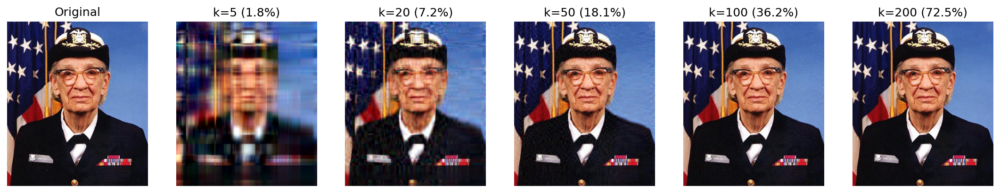
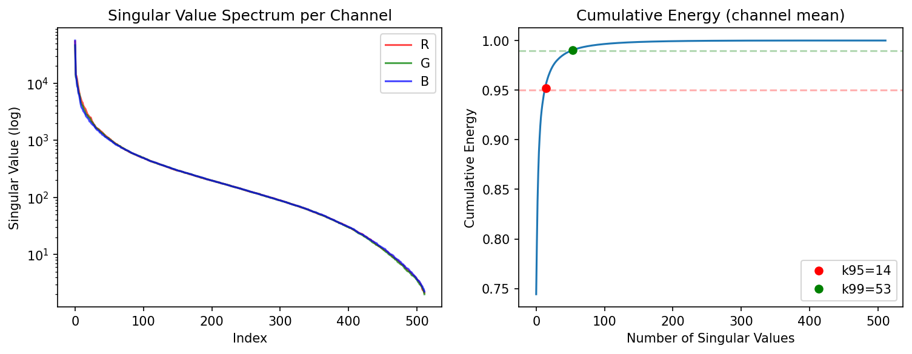

# SVD Image Compression
Computing compression ratios, energy and errors for RGB color images.

 

## Background

Singular values of natural images decrease rapidly. So a low rank approximation with only the top few singular values looks close to the original. In this project, images are approximated by truncating the SVD at rank k. Compression ratios and cumulative energy are also measured. 

### Low-rank approximation
$A_k = \sum_{i=1}^{k} \sigma_i u_i v_i^T$
$\text{error} = \|A - A_k\|_F / \|A\|_F$

### Compression ratio
If original image is m x n,
Storage for rank-k: $k(m+n+1)$ numbers
Compression ratio: $k(m+n+1)/(mn)$

### Cumulative energy
$\sum_{i=1}^{k}\sigma_i^2 / \sum_{i=1}^{n}\sigma_i^2$

## Results


Errors are computed over the full RGB image. Cumulative energy is averaged over the three channels.

Just 14 of 512 singular values capture 95% of the energy (53 for 99%).

| k | storage | error |
|---|---------|-------|
| 5 | 2% | 0.33 |
| 20 | 7% | 0.18 |
| 50 | 18% | 0.10 |
| 100 | 36% | 0.06 |
| 200 | 72% | 0.03 |

## Usage

```bash
   jupyter notebook svd_compression.ipynb
```

## What I learned
The measured errors matched the theoretical values from the Eckart–Young theorem (‖A−Aₖ‖²_F = Σᵢ₌ₖ₊₁ σᵢ²) to four decimal places (R channel). SVD of natural images can be truncated because of the rapid decay of the singular values. However, the benefit of compression diminishes as k grows because the storage cost grows as k grows (when k=200, 72% of the original storage). This shows why practical codecs rely on different transforms.
